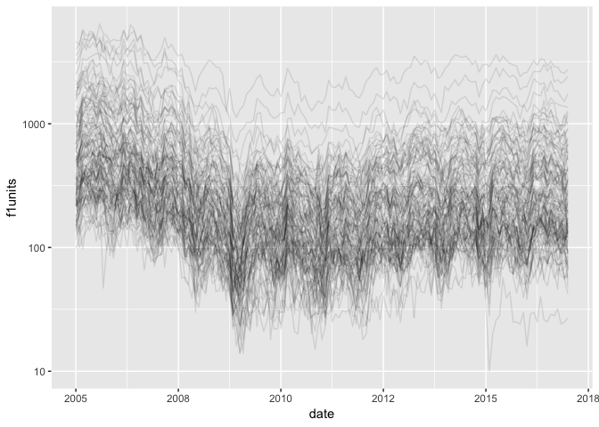

Code Through - Whole Game (Hadley Wickham)
================

# US building permits

``` r
knitr::opts_chunk$set(echo = TRUE,  
                      tidy = FALSE,
                      size = "small"
                      #dev = "cairo_pdf"
                      )
library(tidyverse)
library(magrittr)
library(hrbrthemes)
library(skimr)
library(Cairo)
library(extrafont)
extrafont::loadfonts()
```

# Import

Download the data from [this
site](https://www.recenter.tamu.edu/data/building-permits#!/state/United_States)

``` r
# fs::dir_ls("data")
permits_raws <- read_csv("data/MSAdataPermit_fullmo.csv")
```

    ## Parsed with column specification:
    ## cols(
    ##   area = col_character(),
    ##   date = col_character(),
    ##   f1units = col_double(),
    ##   f1change = col_character(),
    ##   f1value = col_double(),
    ##   f1valchange = col_character(),
    ##   f24units = col_double(),
    ##   f24change = col_character(),
    ##   f24value = col_double(),
    ##   f24valchange = col_character(),
    ##   f5units = col_double(),
    ##   f5change = col_character(),
    ##   f5value = col_double(),
    ##   f5valchange = col_character()
    ## )

``` r
permits_raws
```

    ## # A tibble: 92,945 x 14
    ##    area  date  f1units f1change f1value f1valchange f24units f24change
    ##    <chr> <chr>   <dbl> <chr>      <dbl> <chr>          <dbl> <chr>    
    ##  1 Abil… 01/1…      24 null       67900 null               4 null     
    ##  2 Abil… 02/1…      39 null       75900 null               0 null     
    ##  3 Abil… 03/1…      38 null       78000 null               4 null     
    ##  4 Abil… 04/1…      29 null       66500 null               0 null     
    ##  5 Abil… 05/1…      29 null       77600 null               0 null     
    ##  6 Abil… 06/1…      42 null       66500 null               0 null     
    ##  7 Abil… 07/1…      48 null       67600 null              18 null     
    ##  8 Abil… 08/1…      67 null       69000 null               0 null     
    ##  9 Abil… 09/1…      53 null       60800 null               2 null     
    ## 10 Abil… 10/1…      80 null       73000 null               2 null     
    ## # … with 92,935 more rows, and 6 more variables: f24value <dbl>,
    ## #   f24valchange <chr>, f5units <dbl>, f5change <chr>, f5value <dbl>,
    ## #   f5valchange <chr>

  - area = metropolitan standard area
  - date = month / year (character vector, or strings)  
  - f1 = 1 family, f24 = 2-4 families, f5 = 5+ families  
  - units = number of buildings, change in units; value = average value
    of building; valchange = change in value

<!-- end list -->

``` r
permits_raws %>% 
  tidyr::separate(data = ., 
                  col = date, 
                  into = c("month", "year"), 
                  sep = "/", 
                  convert = TRUE) %>% head()
```

    ## # A tibble: 6 x 15
    ##   area  month  year f1units f1change f1value f1valchange f24units f24change
    ##   <chr> <int> <int>   <dbl> <chr>      <dbl> <chr>          <dbl> <chr>    
    ## 1 Abil…     1  1980      24 null       67900 null               4 null     
    ## 2 Abil…     2  1980      39 null       75900 null               0 null     
    ## 3 Abil…     3  1980      38 null       78000 null               4 null     
    ## 4 Abil…     4  1980      29 null       66500 null               0 null     
    ## 5 Abil…     5  1980      29 null       77600 null               0 null     
    ## 6 Abil…     6  1980      42 null       66500 null               0 null     
    ## # … with 6 more variables: f24value <dbl>, f24valchange <chr>,
    ## #   f5units <dbl>, f5change <chr>, f5value <dbl>, f5valchange <chr>

``` r
permits <- permits_raws %>% 
  tidyr::separate(data = ., 
                  col = date, 
                  into = c("month", "year"), 
                  sep = "/", 
                  convert = TRUE)
```

## Basic EDA

These are just counts of the categorical data

``` r
permits %>% dplyr::count(year) %>% utils::head()
```

    ## # A tibble: 6 x 2
    ##    year     n
    ##   <int> <int>
    ## 1  1980   300
    ## 2  1981   300
    ## 3  1982   300
    ## 4  1983   300
    ## 5  1984   300
    ## 6  1991   300

``` r
permits %>% dplyr::count(area) %>% utils::head()
```

    ## # A tibble: 6 x 2
    ##   area                            n
    ##   <chr>                       <int>
    ## 1 Abilene, TX                   392
    ## 2 Akron, OH                     236
    ## 3 Albany-Schenectady-Troy, NY   236
    ## 4 Albany, GA                    236
    ## 5 Albany, OR                    236
    ## 6 Albuquerque, NM               236

``` r
permits %>% dplyr::count(area) %>% dplyr::count(n)
```

    ## # A tibble: 6 x 2
    ##       n    nn
    ##   <int> <int>
    ## 1   128     1
    ## 2   177     1
    ## 3   192    14
    ## 4   236   340
    ## 5   348     2
    ## 6   392    23

## Create `date` variable

This will put time on the x-axis. January 2007 will be `2007`, February
2007 with be `2007` plus a little bit more.

``` r
permits <- permits %>% 
  dplyr::mutate(date = year + (month - 1) / 12)
permits %>% dplyr::glimpse(78)
```

    ## Observations: 92,945
    ## Variables: 16
    ## $ area         <chr> "Abilene, TX", "Abilene, TX", "Abilene, TX", "Abilene,…
    ## $ month        <int> 1, 2, 3, 4, 5, 6, 7, 8, 9, 10, 11, 12, 1, 2, 3, 4, 5, …
    ## $ year         <int> 1980, 1980, 1980, 1980, 1980, 1980, 1980, 1980, 1980, …
    ## $ f1units      <dbl> 24, 39, 38, 29, 29, 42, 48, 67, 53, 80, 44, 65, 55, 4,…
    ## $ f1change     <chr> "null", "null", "null", "null", "null", "null", "null"…
    ## $ f1value      <dbl> 67900, 75900, 78000, 66500, 77600, 66500, 67600, 69000…
    ## $ f1valchange  <chr> "null", "null", "null", "null", "null", "null", "null"…
    ## $ f24units     <dbl> 4, 0, 4, 0, 0, 0, 18, 0, 2, 2, 0, 4, 6, 0, 0, 0, 8, 20…
    ## $ f24change    <chr> "null", "null", "null", "null", "null", "null", "null"…
    ## $ f24value     <dbl> 46200, 0, 37000, 0, 0, 0, 24400, 0, 31200, 23800, 0, 5…
    ## $ f24valchange <chr> "null", "null", "null", "null", "null", "null", "null"…
    ## $ f5units      <dbl> 200, 0, 0, 0, 0, 0, 0, 0, 0, 152, 0, 0, 0, 0, 0, 0, 12…
    ## $ f5change     <chr> "null", "null", "null", "null", "null", "null", "null"…
    ## $ f5value      <dbl> 12800, 0, 0, 0, 0, 0, 0, 0, 0, 22700, 0, 0, 0, 0, 0, 0…
    ## $ f5valchange  <chr> "null", "null", "null", "null", "null", "null", "null"…
    ## $ date         <dbl> 1980, 1980, 1980, 1980, 1980, 1980, 1980, 1981, 1981, …

First plot with points.

``` r
permits %>% 
  ggplot2::ggplot(aes(x = date, y = f1units)) + 
    ggplot2::geom_point()
```

<!-- -->

Not very useful. Try lines.

``` r
permits %>% 
  ggplot2::ggplot(aes(x = date, y = f1units)) + 
    ggplot2::geom_line()
```

<!-- -->

Not useful–needs the `group = area`.

``` r
permits %>% 
  ggplot2::ggplot(aes(x = date, y = f1units)) + 
    ggplot2::geom_line(aes(group = area))
```

<!-- -->

> I’m going to limit my plot to 2005 - 2017 to look more like the plot
> in the video.

## Filter data to 2005 - 2017

``` r
permits <- permits %>% dplyr::filter(date >= 2005 & date <= 2017)
```

Now do this plot again.

``` r
permits %>% 
  ggplot2::ggplot(aes(x = date, y = f1units)) + 
    ggplot2::geom_line(aes(group = area))
```

<!-- -->

## Focus

Focus on big cities. This might bias results (big cities are different
than small cities).

``` r
f1units <- permits %>% 
  dplyr::group_by(area) %>% 
  dplyr::summarise(mean = mean(f1units)) %>% 
  dplyr::arrange(desc(mean))
f1units %>% head(10)
```

    ## # A tibble: 10 x 2
    ##    area                                          mean
    ##    <chr>                                        <dbl>
    ##  1 Houston-The Woodlands-Sugar Land, TX         2897.
    ##  2 Dallas-Fort Worth-Arlington, TX              2109.
    ##  3 Atlanta-Sandy Springs-Roswell, GA            1813.
    ##  4 Phoenix-Mesa-Scottsdale, AZ                  1550.
    ##  5 Washington-Arlington-Alexandria, DC-VA-MD-WV 1119.
    ##  6 Riverside-San Bernardino-Ontario, CA         1022.
    ##  7 Charlotte-Concord-Gastonia, NC-SC            1010.
    ##  8 Chicago-Naperville-Elgin, IL-IN-WI            971.
    ##  9 Orlando-Kissimmee-Sanford, FL                 928.
    ## 10 New York-Newark-Jersey City, NY-NJ-PA         923.

Now filter this to those greater than 100 every month.

``` r
f1units %>% 
  # how many cities have a mean f1units over 100?
  dplyr::filter(mean > 100) %>% 
  # use this to look at the structure of resulting 116
  dplyr::glimpse(78)
```

    ## Observations: 116
    ## Variables: 2
    ## $ area <chr> "Houston-The Woodlands-Sugar Land, TX", "Dallas-Fort Worth-Arl…
    ## $ mean <dbl> 2897.3, 2109.2, 1813.2, 1550.5, 1119.0, 1022.3, 1010.1, 971.4,…

## Semi join to `permits`

> this is a cool trick to get the cities with a mean \> 100 (in
> `f1units` data frame).

``` r
permits_big <- permits %>% 
  dplyr::semi_join(x = ., 
                   # join this to the f1units
                   y = f1units %>% 
                     # but filter this to the mean greater than 100
                     dplyr::filter(mean > 100),
                   by = "area")
permits_big %>% dplyr::glimpse(78)
```

    ## Observations: 16,820
    ## Variables: 16
    ## $ area         <chr> "Albuquerque, NM", "Albuquerque, NM", "Albuquerque, NM…
    ## $ month        <int> 1, 2, 3, 4, 5, 6, 7, 8, 9, 10, 11, 12, 1, 2, 3, 4, 5, …
    ## $ year         <int> 2005, 2005, 2005, 2005, 2005, 2005, 2005, 2005, 2005, …
    ## $ f1units      <dbl> 387, 520, 504, 724, 576, 700, 458, 655, 637, 552, 502,…
    ## $ f1change     <chr> "-8.1", "-27.2", "-34.6", "19.1", "-4", "18.6", "-28.7…
    ## $ f1value      <dbl> 143600, 143500, 137500, 144200, 144400, 122800, 144000…
    ## $ f1valchange  <chr> "20.4", "29", "18.2", "20.9", "19", "3.4", "14.7", "-2…
    ## $ f24units     <dbl> 0, 3, 0, 0, 0, 6, 18, 7, 6, 7, 3, 3, 4, 4, 3, 3, 3, 6,…
    ## $ f24change    <chr> "-100", "0", "-100", "-100", "-100", "0", "0", "0", "5…
    ## $ f24value     <dbl> 0, 29100, 0, 0, 0, 55800, 40400, 44300, 55800, 44300, …
    ## $ f24valchange <chr> "-100", "0", "-100", "-100", "-100", "13.6", "0", "0",…
    ## $ f5units      <dbl> 0, 13, 0, 34, 60, 26, 0, 28, 36, 24, 28, 24, 22, 36, 3…
    ## $ f5change     <chr> "-100", "0", "0", "142.9", "0", "0", "0", "0", "63.6",…
    ## $ f5value      <dbl> 0, 50000, 0, 29400, 70900, 47900, 0, 47900, 47900, 479…
    ## $ f5valchange  <chr> "-100", "0", "0", "-16", "0", "0", "0", "0", "-58.2", …
    ## $ date         <dbl> 2005, 2005, 2005, 2005, 2005, 2005, 2006, 2006, 2006, …

Now redo the plot with `ggplot2::geom_line()` with only big cities.

``` r
permits_big %>% 
  ggplot2::ggplot(aes(x = date, y = f1units)) + 
    ggplot2::geom_line(aes(group = area))
```

<!-- -->

Add the `alpha = 1/10` to see the lines a little clearer…

``` r
permits_big %>% 
  ggplot2::ggplot(aes(x = date, y = f1units)) + 
    ggplot2::geom_line(aes(group = area), alpha = 1/10)
```

<!-- -->

Add the `ggplot2::scale_y_log10()` to reduce the difference in the
biggest and smallest `big` cities.

``` r
permits_big %>% 
  ggplot2::ggplot(aes(x = date, y = f1units)) + 
    ggplot2::geom_line(aes(group = area), alpha = 1/10) + 
      ggplot2::scale_y_log10()
```

<!-- -->

Now we can see a bit of a pattern in the data.

Add a `ggplot2::geom_smooth()` line to see the long term trends.

``` r
permits_big %>% 
  ggplot2::ggplot(aes(x = date, y = f1units)) + 
    ggplot2::geom_line(aes(group = area), alpha = 1/10) + 
      ggplot2::scale_y_log10() + 
        ggplot2::geom_smooth(se = FALSE)
```

    ## `geom_smooth()` using method = 'gam' and formula 'y ~ s(x, bs = "cs")'

<!-- -->

## Model

Models are a great way to partition the signal into a monthly component.

Start with one city
`"Houston"`.

``` r
houston <- permits %>% dplyr::filter(stringr::str_detect(area, "Houston"))
houston %>% dplyr::count(area)
```

    ## # A tibble: 1 x 2
    ##   area                                     n
    ##   <chr>                                <int>
    ## 1 Houston-The Woodlands-Sugar Land, TX   145

Now plot only Houston.

``` r
houston %>% 
  ggplot2::ggplot(aes(x = date, y = f1units)) + 
    ggplot2::geom_line(aes(group = area))
```

<!-- -->

Check this again by putting the `month` on the `x` and `group` = `year`.

``` r
houston %>% 
  ggplot2::ggplot(aes(x = month, y = f1units)) + 
    ggplot2::geom_line(aes(group = year)) + 
      ggplot2::scale_y_log10()
```

<!-- -->

This shows more building permits earlier in the year than later in the
year.

Questions:

  - is this pattern the same everywhere?

  - what drives this? is it the weather?

  - Houston in July is less pleasant than Houston in December.

We build a model.

“I don’t believe this is a good model, I’m just going to use it to
partition this signal into a monthly effect”.

``` r
library(modelr)
houston_mod <- lm(log(f1units) ~ factor(month), data = houston)
```

## Look at the predictions

Add the predictions to the model with `modelr::add_predictions()`

``` r
houston %>% 
  # adds a column of predictions to the model
  modelr::add_predictions(houston_mod) %>% 
  ggplot2::ggplot(aes(x = date, y = pred)) + 
  ggplot2::geom_line()
```

<!-- -->

The model has captured the seasonal pattern of the permits.

## Look at the residuals

Now look at the residuals or “what remains after we remove the monthly
signal” with `modelr::add_residuals()`.

``` r
houston %>% 
  # adds a column of predictions to the model
  modelr::add_residuals(houston_mod) %>% 
  ggplot2::ggplot(aes(x = date, y = resid)) + 
  ggplot2::geom_line()
```

<!-- -->

Now we can see what the pattern is with the monthly pattern removed.

Questions:

  - What is driving this trend?  
  - What happened in 2010?

## Extend the model to every city

Now use `dplyr`, `tidyr`, and `purrr` to extend the model to every city
in the data set.

The `tidyr::nest()` function works like so:

> `nest()` creates a list of data frames containing all the nested
> variables: this seems to be the most useful form in practice.

``` r
by_area <- permits_big %>% 
  dplyr::group_by(area) %>% 
  tidyr::nest()
by_area %>% utils::head(10)
```

    ## # A tibble: 10 x 2
    ##    area                              data               
    ##    <chr>                             <list>             
    ##  1 Albuquerque, NM                   <tibble [145 × 15]>
    ##  2 Allentown-Bethlehem-Easton, PA-NJ <tibble [145 × 15]>
    ##  3 Asheville, NC                     <tibble [145 × 15]>
    ##  4 Atlanta-Sandy Springs-Roswell, GA <tibble [145 × 15]>
    ##  5 Augusta-Richmond County, GA-SC    <tibble [145 × 15]>
    ##  6 Austin-Round Rock, TX             <tibble [145 × 15]>
    ##  7 Bakersfield, CA                   <tibble [145 × 15]>
    ##  8 Baltimore-Columbia-Towson, MD     <tibble [145 × 15]>
    ##  9 Baton Rouge, LA                   <tibble [145 × 15]>
    ## 10 Bend-Redmond, OR                  <tibble [145 × 15]>

This dataset has two columns: `area` is a character vector, and `data`
is a column that contains a tibble in each row.

``` r
by_area %>% 
  dplyr::select(data) %>% 
  utils::head(1) %>% 
  utils::str() 
```

    ## Classes 'tbl_df', 'tbl' and 'data.frame':    1 obs. of  1 variable:
    ##  $ data:List of 1
    ##   ..$ :Classes 'tbl_df', 'tbl' and 'data.frame': 145 obs. of  15 variables:
    ##   .. ..$ month       : int  1 2 3 4 5 6 7 8 9 10 ...
    ##   .. ..$ year        : int  2005 2005 2005 2005 2005 2005 2005 2005 2005 2005 ...
    ##   .. ..$ f1units     : num  387 520 504 724 576 700 458 655 637 552 ...
    ##   .. ..$ f1change    : chr  "-8.1" "-27.2" "-34.6" "19.1" ...
    ##   .. ..$ f1value     : num  143600 143500 137500 144200 144400 ...
    ##   .. ..$ f1valchange : chr  "20.4" "29" "18.2" "20.9" ...
    ##   .. ..$ f24units    : num  0 3 0 0 0 6 18 7 6 7 ...
    ##   .. ..$ f24change   : chr  "-100" "0" "-100" "-100" ...
    ##   .. ..$ f24value    : num  0 29100 0 0 0 55800 40400 44300 55800 44300 ...
    ##   .. ..$ f24valchange: chr  "-100" "0" "-100" "-100" ...
    ##   .. ..$ f5units     : num  0 13 0 34 60 26 0 28 36 24 ...
    ##   .. ..$ f5change    : chr  "-100" "0" "0" "142.9" ...
    ##   .. ..$ f5value     : num  0 50000 0 29400 70900 47900 0 47900 47900 47900 ...
    ##   .. ..$ f5valchange : chr  "-100" "0" "0" "-16" ...
    ##   .. ..$ date        : num  2005 2005 2005 2005 2005 ...

`area_model` is the function we will build to extend the model.

``` r
area_model <- function(df) {
  lm(log10(f1units + 1) ~ factor(x = month), data = df)
}
```

Now we use `purrr::map()` and `purrr::map2()` to extend the model
function to each tibble in the `by_area` data frame.

``` r
detrended <- by_area %>% dplyr::mutate(
  model = purrr::map(.x = data, .f = area_model),
  # add_residuals is from modelr
  resids = purrr::map2(.x = data, .y = model, .f = add_residuals)
) %>% tidyr::unnest(resids)
detrended %>% glimpse(78)
```

    ## Observations: 16,820
    ## Variables: 17
    ## $ area         <chr> "Albuquerque, NM", "Albuquerque, NM", "Albuquerque, NM…
    ## $ month        <int> 1, 2, 3, 4, 5, 6, 7, 8, 9, 10, 11, 12, 1, 2, 3, 4, 5, …
    ## $ year         <int> 2005, 2005, 2005, 2005, 2005, 2005, 2005, 2005, 2005, …
    ## $ f1units      <dbl> 387, 520, 504, 724, 576, 700, 458, 655, 637, 552, 502,…
    ## $ f1change     <chr> "-8.1", "-27.2", "-34.6", "19.1", "-4", "18.6", "-28.7…
    ## $ f1value      <dbl> 143600, 143500, 137500, 144200, 144400, 122800, 144000…
    ## $ f1valchange  <chr> "20.4", "29", "18.2", "20.9", "19", "3.4", "14.7", "-2…
    ## $ f24units     <dbl> 0, 3, 0, 0, 0, 6, 18, 7, 6, 7, 3, 3, 4, 4, 3, 3, 3, 6,…
    ## $ f24change    <chr> "-100", "0", "-100", "-100", "-100", "0", "0", "0", "5…
    ## $ f24value     <dbl> 0, 29100, 0, 0, 0, 55800, 40400, 44300, 55800, 44300, …
    ## $ f24valchange <chr> "-100", "0", "-100", "-100", "-100", "13.6", "0", "0",…
    ## $ f5units      <dbl> 0, 13, 0, 34, 60, 26, 0, 28, 36, 24, 28, 24, 22, 36, 3…
    ## $ f5change     <chr> "-100", "0", "0", "142.9", "0", "0", "0", "0", "63.6",…
    ## $ f5value      <dbl> 0, 50000, 0, 29400, 70900, 47900, 0, 47900, 47900, 479…
    ## $ f5valchange  <chr> "-100", "0", "0", "-16", "0", "0", "0", "0", "-58.2", …
    ## $ date         <dbl> 2005, 2005, 2005, 2005, 2005, 2005, 2006, 2006, 2006, …
    ## $ resid        <dbl> 0.3797, 0.4849, 0.3871, 0.5310, 0.4183, 0.4724, 0.3650…

Now we plot the new model data in `resid` column.

``` r
detrended %>% 
  ggplot2::ggplot(aes(x = date, y = resid)) + 
    ggplot2::geom_line(aes(group = area), alpha = 1/10) + 
        ggplot2::geom_smooth(se = FALSE)
```

    ## `geom_smooth()` using method = 'gam' and formula 'y ~ s(x, bs = "cs")'

<!-- -->

This final plot tells us this pattern affects all cities in the data
set.

## Final thoughts

1.  Great problem solving strategy: You have a big problem to solve,
    start with one small piece (Houston), solve it, then generalize this
    to the rest of the problem.

2.  The entire analysis was motivated by this plot:

<!-- end list -->

``` r
permits_big %>% 
  ggplot2::ggplot(aes(x = date, y = f1units)) + 
    ggplot2::geom_line(aes(group = area))
```

<!-- -->

After the manipulations, log transformations, and adding
`ggplot2::geom_smooth()`, we can build a model to see how much the
seasonal pattern contributes to the overall variation.
